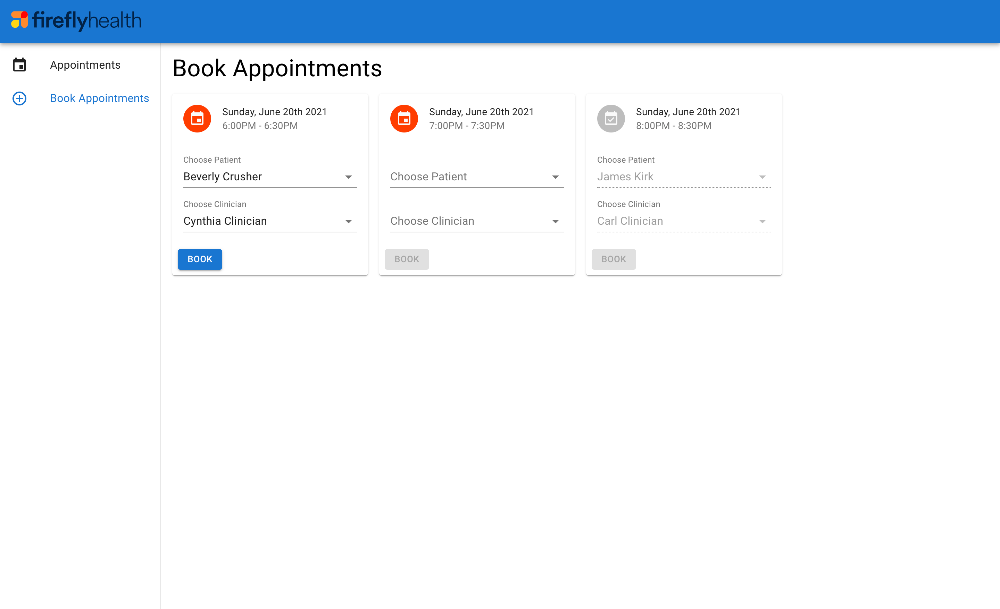
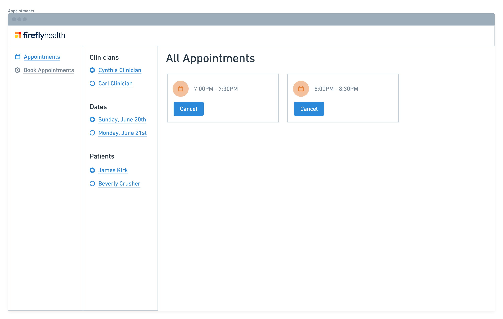

# Firefly Health Take-home Interview

Hello and thank you for interviewing with Firefly!

For this project, you'll be building a miniature version of one of Firefly's real tools: a simple system which allows patients to book appointments with clinicians.

You'll also be using a simplified tech stack that is very similar to Firefly's, however we've abstracted out the backend to be a simple Express server you can run locally (as opposed to Django running through Docker).

Please allocate around 2 hours to dedicate to this project. We want to be as respectful of your time as possible, so instead of spending longer on the project, we'd love to get some feedback on what we can do to improve the exercise.

After receiving your solution, Firefly will schedule a review session, during which you'll present and discuss your solution with some members of our engineering team.

## Tools allowed

**tl;dr: whatever you want + React**

This project is meant to be a realistic demonstration of your coding abilities. This means that it is perfectly fine to Google, refer to documentation / Stack Overflow, and install packages that you find useful.

We've tried not to be overly prescriptive regarding tools or packages, while also providing a somewhat realistic representation of our real tech stack. You are certainly invited to use any tools that you're comfortable with, and ideally be able to explain what makes them a good choice.

The only real requirement here is React. We'll be happy to have an enlivened conversation about Svelte's compiler or Solid's rendering model, but we'll be using React + React Native for the foreseeable future.

If you're not familiar with it, React's [Getting started](https://reactjs.org/docs/getting-started.html) page offers a few ways to get familiar with the library.

**The boilerplate and dependencies in this repo are completely disposable and provided for speed in getting started. By all means, build this how you like!**

### Technologies used in this repo

- Express for the simple backend server
- Prisma connected to local sqlite for db access
- create-react-app for webpack config (we'll be modernizing this soon and we'd love your help to do so!)
- React for frontend rendering
- react-router for routing
- TypeScript for typing

### Technologies we use for real

- Everything above except Express and Prisma
- Django + postgres for the backend
- Swagger codegen for automated API fetching from the frontend
- vitest + testing-library for testing the frontend
- Material UI for component library (pre-configured here if you want it, feel free to remove it if you don't)

## Getting set up

1. Clone this repo
2. `yarn`
3. `yarn prisma db seed` to seed the database with some data
4. `yarn start` will start both the backend and frontend servers in separate processes. You can use BACKEND_PORT and PORT env variables if you need.

## Backend

- A Clinician model, which represents a member of the Firefly clinical team
- An Availability model, which represents availability time slots
- A Patient model
- An Appointment model - which can be used to represent
  - an open appointment (which is a relationship between the availability and clinician)
  - a booked appointment (which is a relationship between the availability, clinician and patient)
- Endpoints for listing all of the clinicians, patients, availabilities and appointments

Everything in `server.ts` as well as `schema.prisma` is fair game to edit if you want to change anything. As a full time frontend engineer at Firefly you won't often be expected to make backend changes, but will be empowered to do so if you want to.

## Frontend

The [/src](/src) subdirectory contains:

- A working create-react-app server
- react-router and Material UI preconfigured (optional)
- A basic index route with instructions

**The boilerplate and dependencies in this repo are completely disposable and provided for speed in getting started. By all means, build this how you like!**

# Instructions

There are a few features that would need to be implemented to go to production.

1. The user should be able to see which availability slots are available for booking
2. The user should be able to book an available appointment slot for a patient and clinician combination
3. The user should be able to see booked appointments for a given clinician, date and patient combination

Please refer to the attached _low-fidelity_ designs. The mockup named `mockup_book_appointments.png` contains designs for the book appointment workflow. The mockup named `mockup_all_appointments.png` contains designs for the view/cancel appointment workflow.

**It's not expected to complete all of these features within two hours.** You might choose to focus on either the API integration, user interaction/reactivity, or implementing the design. You might also choose to focus on either breadth of as many of the features as possible or the depth of focus areas. There is absolutely no right or wrong answer, the idea is to focus on what you are most interested in and feel best demonstrates your skillset, and then to discuss the tradeoffs and choices.

## Designs

## Components:

If you're using [Material UI](https://material-ui.com/), here's a list of components from the library to help make getting started a little easier.

- [Appbar](https://material-ui.com/components/app-bar)
- [Avatar](https://material-ui.com/components/avatars)
- [Box](https://material-ui.com/components/box)
- [Button](https://material-ui.com/components/buttons)
- [Card](https://material-ui.com/components/cards)
- [List](https://material-ui.com/components/lists)
- [Select](https://material-ui.com/components/selects)
- [Typography](https://material-ui.com/components/typography)

## Submitting your project

Please fork this repository to your own GitHub account.

When you're finished and ready to submit your solution, please either include an email link to your fork, or provide your solution as a git bundle over email.

Good luck and please let us know if you have any questions!
